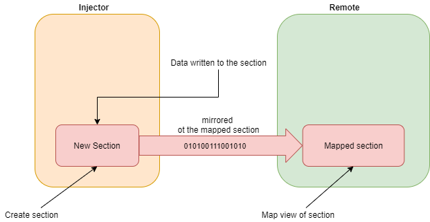

# Code injections 101

## Windows Internals

**Basic terms:**

Explaining the following terms:

- Process - object that contains the required data for the OS to run code

- Thread - object which executes the code

- Module - a library that exports functions for other processes to use

- Handle - a pointer to a kernel object (such as, process, thread, file, etc...)

- Win32 API - a way for applications to interact with the Windows operation system

**Virtual Memory:**

Page - a chunk of bytes in the memory

Section - a continues block of pages with the same access permissions

Address spaces - Each applications has its own user mode virtual address space and all applications share the same kernel mode address space.

ASLR - a (security) feature that allows applications to load at random locations in the memory

**PE Headers:**

A set of headers that defines how the OS should load and run the given executable file.

---

*Show casing CFF Explorer and going through the different headers*

---

Export table - a collection of functions inside the current PE file that could be used by other PE file

Import table - a collection of required functions from different DLLs

Relocation table - when fixed address is being used and the PE file didn't load to the preferred image base address, the new address will be listed in this table

## Code Injections

**Motives:**

- Stealth - hiding malicious process presence
- Process piggybacking - avoiding process depended access
- Altering functionality of another process or entire OS

**Code injection techniques:**

- Process hoolowing
- Thread injection
- DLL injection

	- Classical DLL injection
	- Reflective DLL injection

- Shellcode injection
- Code cave
- Atom bombing
- Process doppelganging
- PE injection

**General steps of code injection**

- NOTE: *The target process is often referred to as the remote process or target process. The process that does the injection is often called the injector process*

- Locate the target for code injection

	- Finding opened process -   
		- `OpenProcess()`  
		- `CreateTool32HelpSnapshot()`  
		- `Process32First()`  
		- `Process32Next()`  
	- Creating new one - 
		- `CreateProcessA()`  
		- `CreateProcessW()`  
		- `CreateProcessInternalA()`  
		- `CreateProcessInternalW()`  
		- `CreateProcessAsUser()`  
		- `CreateProcessWithLogonW()`  

- Acquire DebugPriviledges -  
	- `OpenProcess(PROCESS_ALL_ACCESS, ...)`  
	- `OpenProcessToken()`  
	- `LookupPrivilegeValue()`  
	- `AdjustTokenPrivileges()`  

- Allocate/create memory/space in the target process of virtual memory 
	- Option 1 - using   
		- `VirtualAllocEx()`  
		- `VirtualProtect()`  

	- Option II - using section objects. we create new section objects and map (mirror) it into the remote process  
		- `NtCreateSection()`   
		- `NtMapViewOfSection()`  
		- `NtUnmapViewOfSection()`  

	

	- Permissions
		- Allocate read, write and execute section
		- Allocate read, write and after writing the injected data change to read, executie

- Write/inject code into the allocated memory/space in the target -  
	- `Remote process - WriteProcessMemory()`   
	- `Section object - memcpy(), CopyMemory()`, etc...

- Execute the injected code in the target
  
  - Remote thread creation - creating a new thread in the target process pointed to the injected code address  
    - `CreateRemoteThread()`  
	- `RtlCreateUserThread()`  
  	- `NtCreateThreadEx()`  
	
  - Asynchronous procedure call queues - before returning to the main execution after being in alertable state, the **thread** checks its APC queue and executes any procedure presents there
    - Entering alertable state
      - `SleepEx()`
      - `WaitForSingleObject()`
      - `WaitForMultipleObjectsEx()`
      - `SignalObjectAndWait()`
      - `MsgWaitForMultipleObjects()`
    - Inserting new APC to the queue
      - `OpenThread()` - used in the next function
      - `QueueUserAPC()`

  - Altering thread context - transferring thread's EIP to the injected code. 
    - Make sure the thread is suspended
      - `SuspendThread()`
    - Get a pointer to the EIP register (part of the thread's context)
      - `GetThreadContext()`
    - Change the EIP value to the address of the injected code
    - Update the new thread's context to be the modified one 
      - `SetThreadContext()`
    - Resume thread execution
      - `ResumeThread()`
  
### Classic DLL Injection

- The DLL located somewhere on the disk
- The injector process allocates memory in the target process
- The injector writes the DLL's path to the allocated memory
- The injector obtains the address of `LoadLibrary()` (or any other equivalent function)
  - using `GetProcAddress()`
  - parsing the `_PEB` than parsing the export table of the function's DLL
- The injector invokes `LoadLibrary()` (using the methods described earlier)

### Process Hollowing

- The malware creates new benign process (svchost.exe, explorer.exe, ...) in a suspended state
- The malware hollows the actual code/data of the process
- The malware writes the malicious code to the hollowed place
- The malware resets the EIP to point to the desired function

### Classic Shellcode Injection

- The injector allocates memory on the target process
- The injector copies the shellcode into the target's process memory
- The injector transfers the execution of the target process to the shellcode

## Sysmon Mapping

API calls could be mapped into sysmon events:

- **`OpenProcess()` -> Event ID 10: ProcessAccess, Event Code 4656:  A handle to an object was requested**

- **`CreateProcessW()` -> Event ID 1: Process creation**
- **`CreateProcessInternalA()` -> Event ID 1: Process creation**
- **`CreateProcessInternalW()` -> Event ID 1: Process creation**
- **`CreateProcessAsUser()` -> Event ID 1: Process creation**
- **`CreateProcessWithLogonW()` -> Event ID 1: Process creation**

- **`LoadLibrary*()` -> Event ID 7: Image loaded**
- **`NtMapViewOfSection()` -> Event ID 7: Image loaded** 

- **`CreateRemoteThread()` -> Event ID 8: CreateRemoteThread**  
- **`RtlCreateUserThread()` -> Event ID 8: CreateRemoteThread**  
- **`NtCreateThreadEx()` -> Event ID 8: CreateRemoteThread**

## Case Study: Process Hollowing Detection Engineering

**What do we know about process hollowing?**

1. Creates new process in suspended state
2. Unmaps memory within the target process
3. Allocates memory within the target process
4. Write the malware sections into the target process
5. Resume execution

**What are the things that attack cannot avoid from doing?**

1. Create the process in suspended state 
2. Access to the new process
3. Call `ResumeThread` after altering the process's memory

**Which event we should look for?**

- Process creation -> 1, 7, 4688
- Process access -> 10
  - Access granted -> `PROCESS_VM_WRITE`, `PROCESS_VM_OPERATION`, `PROCESS_SUSPEND_RESUME`, `PROCESS_CREATE_PROCESS`
- Process terminates -> 5 (the original/parent process)

## References:

[1] https://posts.specterops.io/understanding-and-defending-against-access-token-theft-finding-alternatives-to-winlogon-exe-80696c8a73b

[2] https://posts.specterops.io/engineering-process-injection-detections-part-1-research-951e96ad3c85