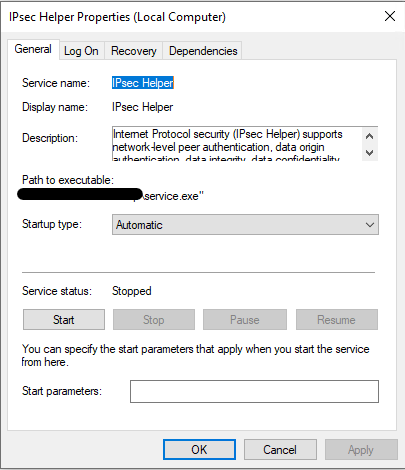

# Shirbit Backdoor Analysis

This blog post will cover the functionality of the dropper used in the [resent breach](https://www.timesofisrael.com/hackers-breach-israeli-insurance-company-steal-client-data/).

I focused on the malware's capabilities and communication protocols, in future post I'll cover how we could identify and prevent such threat.

I divided the post to the following sections:

- [Installation](#-installation) - the malware's first execution
- [Functionality](#-backdoor-functionality) - what are  commands the malware supports
- [Communication protocol](#-communication-protocol) - how the malware communicates with the server
- IoCs

## Installation

The malware needs to be installed as a service using .NET `InstallUtils.exe` and started using `net start "IPsec Helper"`.



Once it installed, the malware:

- Sleeps for 200 - 600 seconds
- Saves the current execution path inside `Software\\Microsoft\\Windows\\CurrentVersion\\Explorer\\Signature`
- Sets install flag for next executions inside `SOFTWARE\\Microsoft\\Default` (value = 140)
- Creates configuration file [#](#configuration-file)
- Checks for internet connection [#](#internet-connection)
- Sends registration request to the server [#](#registration-process)
- Waits for commands

### Configuration file

The configuration file created inside the current execution path with the same name of the executable but `.dat` extension (`service.bat`) or inside the path specified in `Software\\Microsoft\\Windows\\CurrentVersion\\Explorer\\Updater`.


The default configurations stored in the resources are:

```json
{
    "EmbedId":"ltQTLPxCdaCY_El]jb!B", // encryption key
    "InternetNeeded":true,
    "LogEnabled":false,
    "UseCache":false,
    "Interval":10,
    "Relays":
        [
            "http:\\5.2.73.67\Panel\new\File\css\boot.php", 
            "http:\\185.142.98.32\Scripts\_Data\25\lastupdate.php",
            "http:\\185.142.97.81\css\v1\template\main.php"
        ], 
    "DeviceIdSalt":"k+xpGkuWOF5JRREJudQkd3tU6F+rzW24BEaryEl70WH3YUKTM1FxELCie7Xbpg82y4UrjPWh5zkKmMXWF5hU4g==",
    "PublicKeyToken":"e5VtH3ptjMofUBfncDnwUpzYqLB\\/Z+3DOpVUw7n8Mr4=",
    "SessionKey":"eOL1awi41Bl2FW5pqSKFLvO3aHpVeaE0befM7sYJ718=",
    "servers":[]
}
```

*Logging:*  
When logging is enabled, the malware creates new file inside to current execution path with the name `<file_name>.lgo`. The log file contains code number, message,  function and timestamp. The logs are encrypted using `MD5(NodeId)` as encryption key.

*Interval:*  
Used when sleep command passed to the malware (`cmdType` = 8). The malware will sleep for `Config.Interval` seconds.

*Relays:*   
The C&C server which the malware fetches new commands from. The addresses saved encrypted on disk using Rijndael symmetric encryption and `EmbedId` as key.


The malware uses the `EmbedId` as encryption key and encrypts the `Relays` and write the configuration file on disk.

### Internet connection

Internet connection is checked by sending requests to `servers` defined inside the configuration file or default list of servers:

- hxxp://windowsupdate.microsoft.com
- hxxp://windowsupdate.microsoft.nsatc.net
- hxxp://download.windowsupdate.com
- hxxp://download.microsoft.com

With that, the malware:

1. Picks random server
2. Checks if it needs to use proxy server

  - The proxy ip decrypted from `EmbedId` using `PublicKeyToken`
  - The proxy port decrypted from `EmbedId` using `SessionKey`

3. Sends message to the server
4. If there's not response from the server the malware waits random time (30~40, 30~80, 30~160, 30~320, 30~640 seconds) and tries again. 

**Note:** The malware waits for internet connection and won't continue it execution without it.

### Registration process

Now that all checks done, the malware needs to register itself. The malware sends to the server data about the client: 

- `version` 
- `os` - Win32_OperatingSystem.Caption,Version
- `identifier` - Win32_Processor
- `embedid`
- `ostype` - Win32_OperatingSystem.ProductType

I listed the WMI classes used for retrieving the data.

The information sent to the attacker for registration, the C&C server responses with `NodeId` for that client. Same as before, the malware won't continue it execution without getting `NodeId`.

## Backdoor Functionality

Finished with client registration, the malware is ready for executing commands from sent by the server.

Supported remote commands listed below:

|Name|Type|Request|Response|
|----|----|-------|--------|
|[Update relay list](#update-relay-list)|2|new relay list|TODO|
|[Get system information](#get-system-info)|3|-|collected system information|
|[Update malware's engine](#update-malwares-engine)|6|new executable|TODO|
|[Self deletion](#self-deletion)|7|-|TODO|
|[Sleep](#sleep)|8|-|TODO|
|[Get engine version](#get-engine-version)|11|-|engine version|
|[Download and start new executable](#download-and-start-new-executable)|12|name, hash, content|TODO|
|[Download and start executable from url](#download-and-start-executable-from-url)|13|name, hash, url|TODO|
|[File uploading](#file-uploading)|15|path|file in path|
|[Update configuration](#update-configuration)|16|name, hash, value|TODO|
|[Get process ID](#get-process-id)|17|-|process ID|

---

### Update relay list
*Command type: 2*  
*Payload: `relays_array`*  

The malware checks each address inside `relays_array`. The check preformed by sending a POST message to the relay with unique data, `chk=Test`. If more than half failed, it requests from the server to send more.

Finally, it encrypts the array and update the configuration file.

### Get system info  
*Command type: 3*  
*Payload: -*  

Sends the following data to the server (using WMI):

- Domain name - `Win32_ComputerSystem.Domain`
- Host name
- Local time
- Time zone
- User name
- Processor Architecture - `Win32_Processor.AddressWidth`
- Is it laptop? - if `Win32_Battery` exists

### Update malware's engine  
*Command type: 6*  
*Payload: `name`, `hash`, `content`*  

The malware create update script under `%TEMP%\\updater.bat` which responsible for replacing the current malware executable with the new one and restart the service.

After execution, the script deletes itself using `del %0` command.

### Self deletion  
*Command type: 7*  
*Payload: -*  

First, the malware removes its registry foothold:

- Installation path - `SOFTWARE\\Microsoft\\Default`
- Autorun installation - `Software\\Microsoft\\Windows\\CurrentVersion\\Run\\ipsecservice`
- File location - `Software\\Microsoft\\Windows\\CurrentVersion\\Explorer\\Signature`
- Config location - `Software\\Microsoft\\Windows\\CurrentVersion\\Explorer\\Updater`
- NodeId - `Software\\Microsoft\\Windows\\CurrentVersion\\EyeD`

Then, it creates removal script `%TEMP%\\remover.bat` which responsible for uninstalling the created service, remove all files with the malware name (`<name>.*`) and self deletion using `del %0` command.

### Sleep
*Command type: 8*  
*Payload: -*  

Sleeps for `Config.Interval` seconds.

### Get engine version  
*Command type: 11*  
*Payload: -* 

The malware sends the current engine version (default is 2.15.5).

### Download and start new executable
*Command type: 12*  
*Payload: `name`, `hash`, `content`* 

The new executable will be located inside `%TEMP%\\name`, `content` is base64 encoded.

After the new file is created inside `%TEMP%\\name`, the malware executes it and send ACK to the attacker.

### Download and start executable from url  
*Command type: 13*  
*Payload: `name`, `hash`, `content`*  

The malware creates new file: `%TEMP%\\name`. The content of the file downloaded from the url located inside `base64_decode(content)`.

Once, the file's downloaded, the malware executes it.

### Commands execution  
*Command type: 14*  
*Payload: `command_line`* 

Command execution could preform using 3 processes: 

- `%TEMP%\VBE.exe` - If the file exists 
- `powershell.exe` - If `HKEY_LOCAL_MACHINE\\SOFTWARE\\Microsoft\\PowerShell\\1\\Install` exists (which means the powershell available)
- `cmd.exe` - If none of the above found

The new process will start with as `ProcessWindowStyle.Hidden` and the command-line: `<VBE|powershell|cmd> /C <command_line>`.

The output will be written to `stdout` which sent back to the attacker when the new process terminated.

*On error, `%TEMP%\VBE.exe` is deleted and replaced with a copy of `%SYSTEM32%\\WindowsPowerShell\\v1.0\\powershell.exe` (or `%SYSTEM32%\\cmd.exe` if powershell doesn't exist).*

### File uploading  
*Command type: 15*  
*Payload: `file_path`* 

The function sends to the attacker a file according to the `file_path`. The file's data is base64 encoded. The returned payload is:

```cs
FileModel fileModel = new FileModel
{
    name = Path.GetFileName(payload),
    hash = PublicFunction.FileMd5Hashing(payload),
    content = EncodingClass.Base64ByteEncoding(plainData)
};
```

### Update configuration  
*Command type: 16*  
*Payload: `name`, `hash`, `content`* 

The configuration that could be changed are: `LogEnabled` and `Interval` inside `ConfigModel` according to `name`. The new value located inside `content`.

### Get process ID  
*Command type: 17*  
*Payload: -* 

Sends the malware process ID.

## Communication Protocol

The communication between the client and the server preformed over HTTP with the following headers:

- Method: POST  
- UserAgent: `Mozilla/4.0 (compatible; MSIE 7.0; Windows NT 5.1; EmbeddedWB 14.52 from: http://www.google.com/ EmbeddedWB 14.52;\r\n .NET CLR 1.1.4322; .NET CLR 2.0.50727; InfoPath.1; .NET CLR 1.0.3705; .NET CLR 3.0.04506.30)`
- Referrer: `https://www.google.com/`
- ContentType: `application/x-www-form-urlencoded`

Each messages could sent using a proxy server (according to the configurations).

### Message data

The messages are Base64 encoded with the following data:

```json
{
    "NodeId": 0,
    "MessageId": 0,
    "Payload": "<encrypted>",
    "CommandType": "0"
}
```

The payload encrypted using `MessageId` as symmetric key for Rijndael algorithm.

Messages sent through random relay address, with an option for using a proxy server defined inside the configuration file.

*Server -> Client:*

When the server needs to send data to the client it uses the following fields inside the payload: `name`, `hash`, `content`.

The client uses those field differently based on the received `cmdType`.

*Client -> Server:*  

The supported response status codes are:

- Ack - 4
- CrcError - 9
- Failed - 10

*CrcError status returned for messages in which the hash of the `content` field doesn't equal to the `hash` received.*