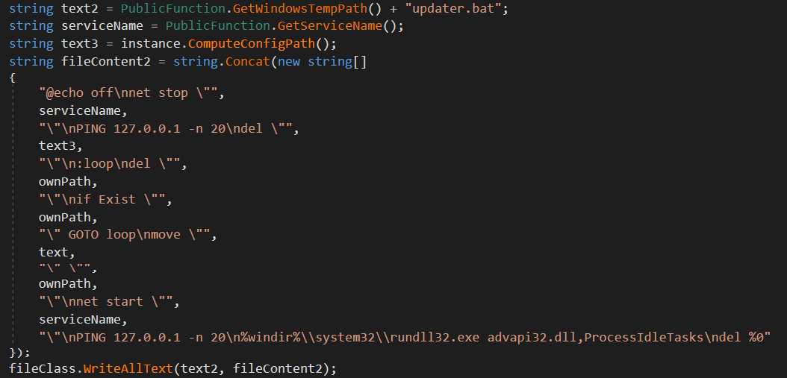

# Shirbit Backdoor Analysis

This blog post will cover the functionality of the dropper used in the [resent breach](https://www.timesofisrael.com/hackers-breach-israeli-insurance-company-steal-client-data/).

I focused on the malware's capabilities and communication protocols, in future post I'll cover how we could identify and prevent such threat.

I divided the post to the following sections:

- [Installation](#-installation) - the malware's first execution
- [Functionality](#-backdoor-functionality) - what are  commands the malware supports
- [Communication protocol](#-communication-protocol) - how the malware communicates with the server
- [IoCs](#iocs)

## Installation

The malware needs to be installed as a service using .NET `InstallUtils.exe` and started using `net start "IPsec Helper"`.


Once installed, the following steps occur:

- Sleep between 200 - 600 seconds
- Save the current execution path inside `Software\\Microsoft\\Windows\\CurrentVersion\\Explorer\\Signature`
- Set install flag for next executions inside `SOFTWARE\\Microsoft\\Default` (value = 140)
- Create configuration file [#](#configuration-file)
- Check for internet connection [#](#internet-connection)
- Send registration request to the server [#](#registration-process)
- Wait for new commands

### Configuration file

The configuration file is created in the current execution path with the same name of the executable and `.dat` extension (`service.bat`) or inside the path specified in `Software\\Microsoft\\Windows\\CurrentVersion\\Explorer\\Updater`, if exists.


The default configurations stored in the resources are:

```json
{
    "EmbedId":"ltQTLPxCdaCY_El]jb!B", // encryption key
    "InternetNeeded":true,
    "LogEnabled":false,
    "UseCache":false,
    "Interval":10,
    "Relays":
        [
            "hxxp:\\\\5.2.73.67\\Panel\\new\\File\\css\\boot.php", 
            "hxxp:\\\\185.142.98.32\\Scripts\\_Data\\25\\lastupdate.php",
            "hxxp:\\\\185.142.97.81\\css\\v1\\template\\main.php"
        ], 
    "DeviceIdSalt":"k+xpGkuWOF5JRREJudQkd3tU6F+rzW24BEaryEl70WH3YUKTM1FxELCie7Xbpg82y4UrjPWh5zkKmMXWF5hU4g==",
    "PublicKeyToken":"e5VtH3ptjMofUBfncDnwUpzYqLB\\/Z+3DOpVUw7n8Mr4=",
    "SessionKey":"eOL1awi41Bl2FW5pqSKFLvO3aHpVeaE0befM7sYJ718=",
    "servers":[]
}
```

*LogEnabled:*  
When logging enabled, the malware creates new file inside the current execution path with the name and `.lgo` extension (`service.lgo`).  
The log file contains a code number, message,  function and timestamp.  
The logs are encrypted using `MD5(NodeId)` as encryption key.

*Interval:*  
This value used when the malware receives a Sleep command from the server.

*Relays:*   
The C&C servers which the malware fetches new commands from. The addresses saved encrypted on disk using Rijndael symmetric encryption and `SHA256(EmbedId)` as key.


The malware uses the `EmbedId` as encryption key for encrypting the `Relays`, then, it writes the configuration file on disk.

### Internet connection

Internet connection is checked by sending requests to `servers` defined inside the configuration file or default list of servers:

- hxxp://windowsupdate.microsoft.com
- hxxp://windowsupdate.microsoft.nsatc.net
- hxxp://download.windowsupdate.com
- hxxp://download.microsoft.com

(*hxxp = http*)

With that, the malware:

1. Picks random server
2. Checks if `UseCache` enabled (means use proxy server)

  - The proxy IP address decrypted from `PublicKeyToken` using `MD5(EmbedId)` as key
  - The proxy port decrypted from `SessionKey` using `MD5(EmbedId)` as key
 
3. Sends message to the server
4. If there's not response from the server the malware waits random time (30-40, 30-80, 30-160, 30-320, 30-640 seconds) and tries again. 

**Note:** The malware waits for internet connection and won't continue without it.

### Registration process

Now that all checks done, the malware needs to register itself. The malware sends to the server the client's data:

- `version` 
- `os` - `Win32_OperatingSystem.Caption,Version`
- `identifier` - `Win32_Processor`
- `embedid`
- `ostype` - `Win32_OperatingSystem.ProductType`
  
For that, the malware utilizes WMI for system information queries. 


*Example of how the malware retrieves the computer's domain name*

The information sent to the attacker which responses with `NodeId`.  
Same as before, the malware won't continue its execution without getting `NodeId`.

## Backdoor Functionality

Finished with client registration, the malware is ready for executing commands sent by the server.

The supported commands are:

|Command|Command Type|Request Params|Response|
|----|----|-------|--------|
|[Update relay list](#update-relay-list)|2|new relay list|Ack/CrcError|
|[Get system information](#get-system-info)|3|-|collected system information|
|[Update malware's engine](#update-malwares-engine)|6|new executable|Ack/Failed/CrcError|
|[Self deletion](#self-deletion)|7|-|Ack|
|[Sleep](#sleep)|8|-|-|
|[Get engine version](#get-engine-version)|11|-|engine version|
|[Download and start new executable](#download-and-start-new-executable)|12|name, hash, content|Ack/Failed/CrcError|
|[Download and start executable from url](#download-and-start-executable-from-url)|13|name, hash, url|Ack/Failed|
| [Command execution](#commands-execution)|14|command line|command result/Failed|
|[File uploading](#file-uploading)|15|path|file in path/Failed|
|[Update configuration](#update-configuration)|16|name, hash, value|Ack/CrcError|
|[Get process ID](#get-process-id)|17|-|process ID/Failed|

---

### Update relay list
*Command type: 2*  
*Payload: `relays_array`*  

The malware checks each address inside `relays_array`. The check is preformed by sending a POST message to the relay with unique data, `chk=Test`. 

Finally, it encrypts the array and update the configuration file.

If more than half of the given `relays_array` failed to answer, it requests from the server to send more relays and sends back a list of failed relays.

#### Hidden super relay

If all of the relays inside `relays_array` are down, the malware sends request to a super relay. This relay is hidden encrypted inside `DeviceIdSalt` using `MD5(EmbedId)` as key.


As we can see, the malware tries to connect to the super relay, if it succeeds, it requests for new relay list, otherwise, it will try again for several times.

After 63-84 minutes for failed attempts, the malware will restart itself by dropping new batch script `ellink.bat` which will restart the service.

The address of the super relay in the default values could be decrypted with:


Which results the URL: `hxxp://whynooneistherefornoneofthem.com/about.php`.

### Get system information  
*Command type: 3*  
*Payload: -*  

The malware collects the following data and sends it back to the server:

- Domain name - `Win32_ComputerSystem.Domain`
- Host name
- Local time
- Time zone
- User name
- Processor Architecture - `Win32_Processor.AddressWidth`
- Is it laptop? - if `Win32_Battery` exists

### Update malware's engine  
*Command type: 6*  
*Payload: `name`, `hash`, `content`*  

The malware create an update script under `%TEMP%\\updater.bat`. The script is responsible for replacing the current malware executable with the new one and restart the service.

After execution, the script deletes itself using `del %0` command.



### Self deletion  
*Command type: 7*  
*Payload: -*  

First, the malware removes its registry foothold:

- Installation path - `SOFTWARE\\Microsoft\\Default`
- Autorun installation - `Software\\Microsoft\\Windows\\CurrentVersion\\Run\\ipsecservice`
- File location - `Software\\Microsoft\\Windows\\CurrentVersion\\Explorer\\Signature`
- Config location - `Software\\Microsoft\\Windows\\CurrentVersion\\Explorer\\Updater`
- NodeId - `Software\\Microsoft\\Windows\\CurrentVersion\\EyeD`

Then, it creates a removal script `%TEMP%\\remover.bat` which is responsible for uninstalling the created service, removing all related files (`service.*`) and self deletion using `del %0` command.

### Sleep
*Command type: 8*  
*Payload: -*  

Sleeps for `Config.Interval` seconds.

### Get engine version  
*Command type: 11*  
*Payload: -* 

The malware sends the current engine version (default is 2.15.5).

### Download and start new executable
*Command type: 12*  
*Payload: `name`, `hash`, `content`* 

The new executable will be located inside `%TEMP%\\name`, `content` is Base64 encoded.

After the new file is created inside `%TEMP%\\name`, the malware executes it and sends ACK message to the attacker.

### Download and start executable from URL  
*Command type: 13*  
*Payload: `name`, `hash`, `content`*  

The malware creates new file, `%TEMP%\\name`. The content of the file downloaded from the URL located inside `Base64Decode(content)`.

Once, the file's downloaded, the malware executes it.

### Commands execution  
*Command type: 14*  
*Payload: `CommandLine`* 

Command will be executed using the following parents: 

- `%TEMP%\VBE.exe` - If it exists
- `powershell.exe` - If `HKEY_LOCAL_MACHINE\\SOFTWARE\\Microsoft\\PowerShell\\1\\Install` exists (which means the PowerShell is available)
- `cmd.exe` - If none of the above found

The new process will start with `ProcessWindowStyle.Hidden` flag.

The output will be written to `stdout` which will be sent back to the attacker when the new process terminates.

*On error, `%TEMP%\VBE.exe` will be deleted and replaced with a copy of `%SYSTEM32%\\WindowsPowerShell\\v1.0\\powershell.exe` (or `%SYSTEM32%\\cmd.exe` if PowerShell doesn't exist).*

### File uploading  
*Command type: 15*  
*Payload: `FilePath`* 

The function sends to the attacker the file located in `FilePath`. The file's data is Base64 encoded. The returned payload is:

- `name` - the name of the file (`FilePath`)
- `hash` - MD5 hash of the file's content
- `content` - the content Base64 encoded

### Update configuration  
*Command type: 16*  
*Payload: `name`, `hash`, `content`* 

The configuration that could be changed are: `LogEnabled` and `Interval` inside `ConfigModel` according to `name`. The new value located inside `content`.

### Get process ID  
*Command type: 17*  
*Payload: -* 

Sends the malware's process ID.

## Communication Protocol

The communication between the client and the server preformed over HTTP with the following headers:

- Method: POST  
- UserAgent: `Mozilla/4.0 (compatible; MSIE 7.0; Windows NT 5.1; EmbeddedWB 14.52 from: http://www.google.com/ EmbeddedWB 14.52;\r\n .NET CLR 1.1.4322; .NET CLR 2.0.50727; InfoPath.1; .NET CLR 1.0.3705; .NET CLR 3.0.04506.30)`
- Referrer: `https://www.google.com/`
- ContentType: `application/x-www-form-urlencoded`

Messages sent through random relay address, with an option for using a proxy server defined inside the configuration file.

### Message data

The messages are Base64 encoded with the following data:

- `NodeId`
- `MessageId`
- `Payload`
- `CommandType`

The payload is encrypted using `MD5(MessageId)` as symmetric key for Rijndael algorithm.

*Server -> Client:*

When the server needs to send data to the client it uses the following fields inside the payload: `name`, `hash`, `content`.

As shown earlier, the client uses those field differently based on the received `cmdType`.

*Client -> Server:*  

The supported response status codes are:

- Ack - 4
- CrcError - 9
- Failed - 10

*CrcError status returned for messages in which the hash of the `content` field doesn't equal to the `hash` received.*

## IoCs

**Registry Keys:**

- `SOFTWARE\\Microsoft\\Default = 140`
- `Software\\Microsoft\\Windows\\CurrentVersion\\Run\\ipsecservice`
- `Software\\Microsoft\\Windows\\CurrentVersion\\Explorer\\Signature`
- `Software\\Microsoft\\Windows\\CurrentVersion\\Explorer\\Updater`
- `Software\\Microsoft\\Windows\\CurrentVersion\\EyeD`

**Dropped Files:**

- `<execution_path>\<exe_name>.dat`
- `<execution_path>\<exe_name>.lgo`
- `%TEMP%\updater.bat`
- `%TEMP%\remover.bat`
- `%TEMP%\ellink.bat`
- `%TEMP%\VBE.exe`

**URLs and IP Addresses:**

- 5.2.73.67
- 185.142.98.32
- 185.142.97.81
- `hxxp://5.2.73.67/Panel/new/File/css/boot.php`
- `hxxp://185.142.98.32/Scripts/_Data/25/lastupdate.php`
- `hxxp://185.142.97.81/css/v1/template/main.php`
- `hxxp://whynooneistherefornoneofthem.com/about.php`

**HTTP Artifacts:**

- `Mozilla/4.0 (compatible; MSIE 7.0; Windows NT 5.1; EmbeddedWB 14.52 from: http://www.google.com/ EmbeddedWB 14.52;\r\n .NET CLR 1.1.4322; .NET CLR 2.0.50727; InfoPath.1; .NET CLR 1.0.3705; .NET CLR 3.0.04506.30)`

## Conclusions

We now understand what capabilities the attacker had while preforming the attack. We also found out what communication protocol and encryption algorithms been used.

With that knowledge and the appropriate logs we could decrypt the attacker's actions and find out what commands they executed? what executable should we investigate next? and what files were stolen?