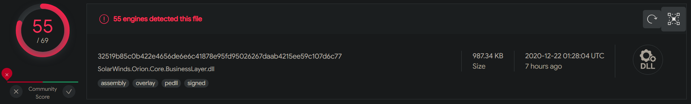
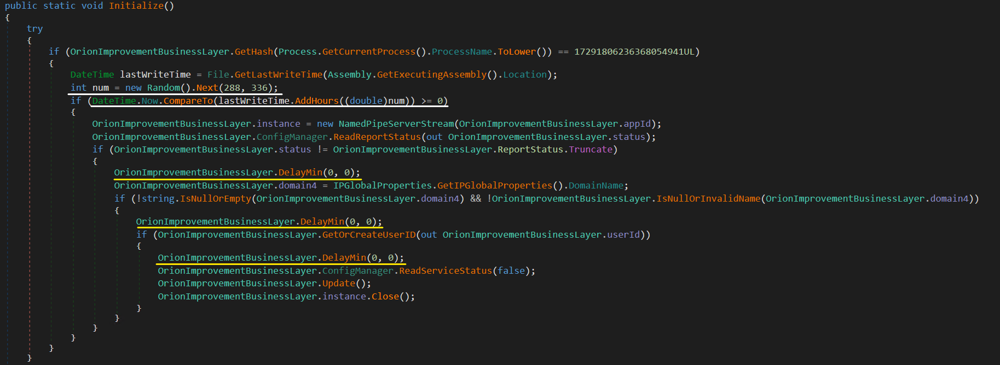
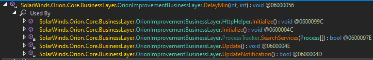
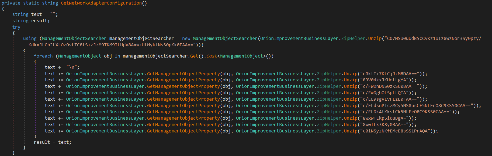
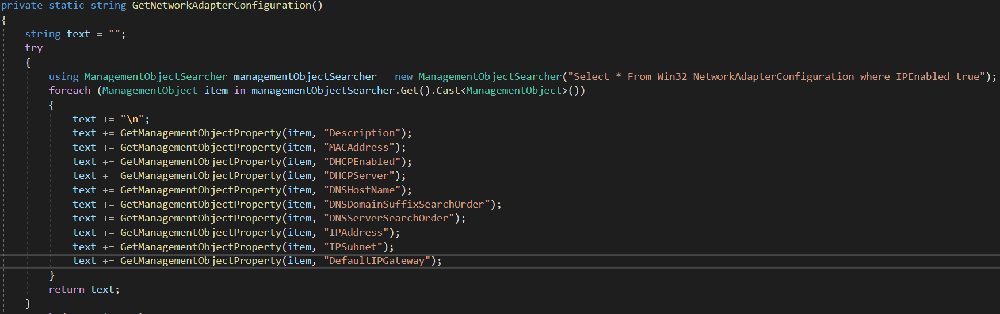
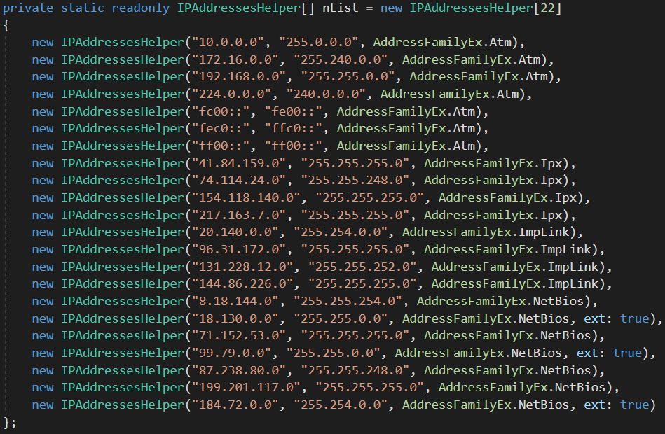
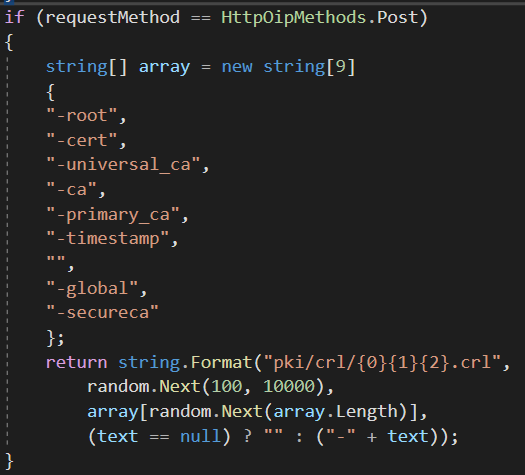
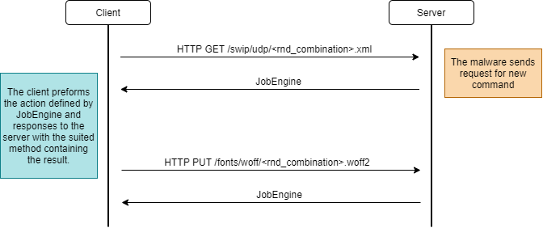
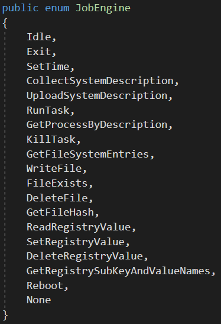
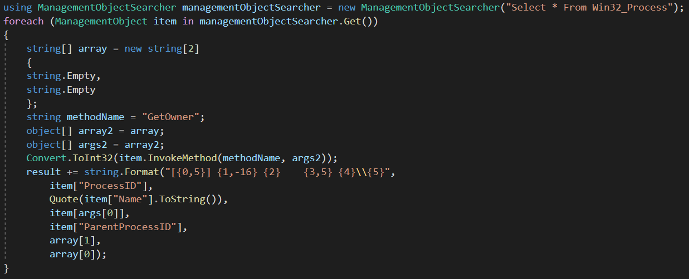

# SUNBURST HYPE!

Since the last season of Game of Thrones I haven't avoided from so many spoilers, and than... the sun burst. Posts and reports are all over the place, I even thought not to post my own report, but who really cares? 😁

At this point, there are plenty analysis reports and blog posts about that piece of malware I chose to give a quick overview on the functions that stood out for me when I've looked at this malware.

*Note: In order to better understand the amount of sophistication  invested in the malware I suggest the you'll follow along and see exactly the different techniques described next are used.*

## Introduction

As you probably know, SolarWinds, a company which supplies IT monitoring and management tools has been breached. SolarWinds, specifically their Orion solution, delivered with malicious backdoor capabilities inside the update installer.

I got my hands on `32519b85c0b422e4656de6e6c41878e95fd95026267daab4215ee59c107d6c77`:



By now, my engines already updated their detections, resulting a higher detection rate than what was before FireEye's publication.

## Patience is bitter, but its fruits are sweet

One of the things that stands out for me is the amount of patience that this malware has. 



Marked with white, we can see that the malware won't start its malicious activity within the first 12-14 days. 

Marked with yellow, the use of `DelayMin` function, which waits between 30-120 minutes. This function is being used across various key functions:



## Strings Obfuscation

Most of hard coded strings are obfuscated using `ZipHelper.Unzip` function. The obfuscation uses `DeflatStream` compression and Base64 encoding.

To ease the rest of the investigation, I've wrote a simple script which finds all references to `ZipHelper.Unzip(some_string)` and replaces them with an their de-obfuscated version:

Before:



After:



## C&C Communication

Resolving the C&C server done by generating random URL which composed with random sub subdomain sting, one of four pre-defined subdomains of `avsvmcloud.com` domain:

- `<random_sub_subdomain>.eu-west-1.avsvmcloud.com`
- `<random_sub_subdomain>.us-west-2.avsvmcloud.com`
- `<random_sub_subdomain>.us-east-1.avsvmcloud.com`
- `<random_sub_subdomain>.us-east-2.avsvmcloud.com`

After generating a hostname, the malware preforms DNS request to get the IP address of the chosen hostname followed by IP address legitimacy check by comparing the resolved IP address with a black-list of subnets:



There's no doubt that the malware's trying to as evasive as possible and the communication protocol between itself and the C&C server is no different. The communication protocol was also built with evasive capabilities. For example, the URL for POST request generated using the following logic:



This pattern repeated for each HTTP method resulting requests that doesn't stand out as malicious activity. Moreover, each method represents different action:

- `GET` - Get new command 
- `HEAD` - ACK - command preformed *without* any output
- `PUT` - Command preformed *with* inflated output *smaller* than 10,000 bytes 
- `POST` - Command preformed *with* inflated output *bigger* than 10,000 bytes 

*Note: inflated data means after the raw data has been compress with the [DEFLATE](https://en.wikipedia.org/wiki/Deflate).*



The body structure is defined by the following JSON:

```json
{
    "userId": "<userId_GUID>",
    "sessionId": "<new_GUID>",
    "steps": [
        {
            "Timestamps": "<random_number>",
            "Index": "<counter>",
            "EventType": "Orion",
            "EventName": "EventManager",
            "DurationMs": "<random_number>",
            "Succeeded": "true",
            "Message": "<Base64_string>"
        },
    ]
}
```

When content needs to be sent through the network, it will be compressed, Base64 encoded and splitted in multiple `steps.Message` fields. 

## Jobs Execution

The `JobEngine` represents the command code sent back to the client. By looking at its definition we revel the different capabilities of this evasive backdoor:



I've collected the functions which aren't as self explanatory as the others: 

### `CollectSystemDescription`

System description:

- Domain Name
- Account SID
- Host Name
- User Name
- OS Version
- OS info - including Caption,OSArchitecture, InstallDate, Organization, RegisteredUser and Version
- System Directory
- Days since last system boot
- Proxy server used

### `UploadSystemDescription`

The malware sends request to URL sent by the server. In addition to the URL, the server controls the HTTP method used, HTTP headers, and request body. 

### `RunTask`

Run new process with arguments sent by the attackers.

### `GetProcessByDescription`

The malware preforms WMI query to get all running processes with chosen description:



### `GetFileSystemEntries`

The attacker send a path and a search pattern and receives the matching files and folders in the infected computer.

## Conclusions

We can continue and talk about the different hashing and evasions of this malware, but I think that in this blog post we achieved a good understanding on what are the main functionalities and evasion patterns used in it.

I really liked the amount of thought invested by the malware authors spanning the execution over time and how the code almost perfectly blended inside the actual installer. 

Hope you learned something new today, and if not, maybe in the next time :) 